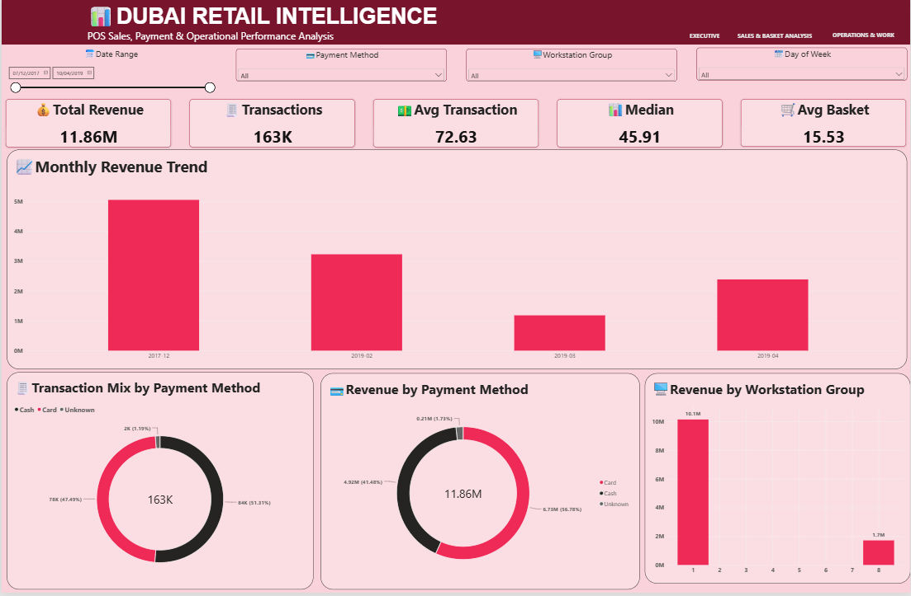
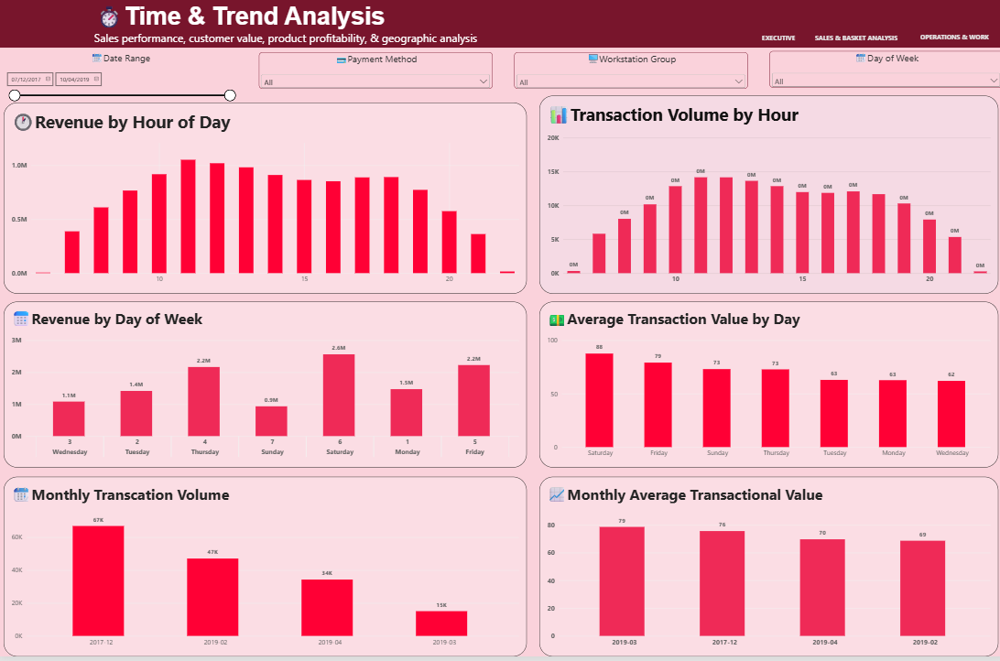
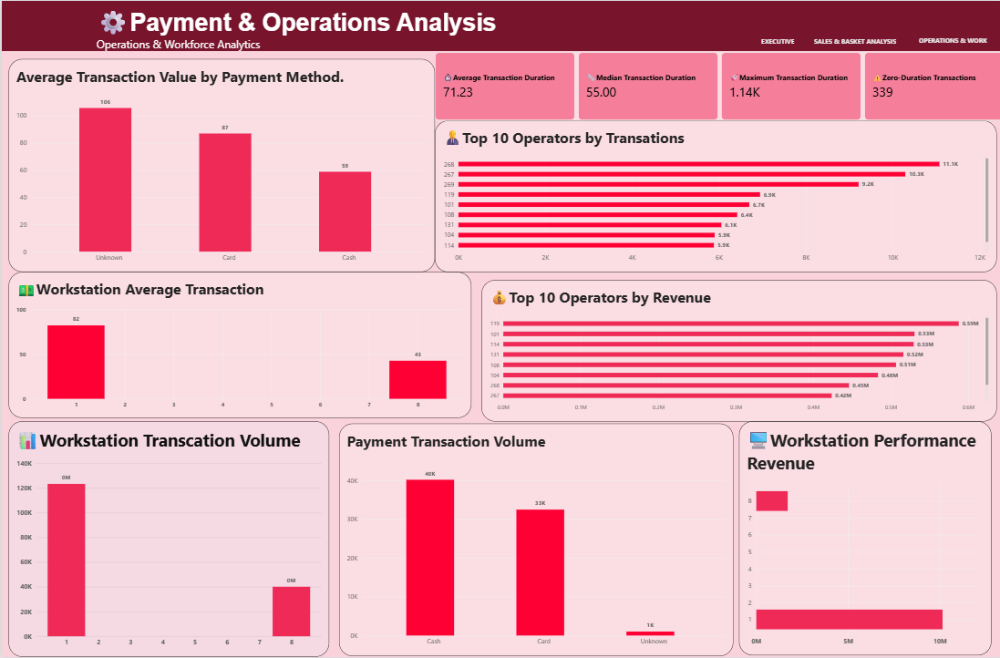

### 🏪 Dubai Retail Intelligence

POS Sales, Payment & Operational Performance Analytics
A retail analytics project built as a Dubai retail business simulation using an open-source POS transaction dataset.

{ Dataset Transparency: This project is presented as a Dubai retail business simulation using an open-source Point of Sale (POS) transaction dataset. The underlying dataset does not represent real transactions from Dubai. Dubai is used as the business context for demonstrating retail analytics, data engineering, SQL, and Power BI capabilities. No claim is made that the original transactions occurred in Dubai. }

### 📌 Project Overview

This project analyzes point-of-sale transaction data to understand sales performance, payment behavior, workstation efficiency, operator performance, transaction timing, and operational patterns.
The project combines Python, PostgreSQL, SQL, and Power BI into an end-to-end analytics workflow — from raw transaction data through cleaning and analytical modeling to an interactive business intelligence dashboard.
Important: The underlying dataset is an open-source POS dataset and does not represent actual transactions from Dubai. Dubai is the business-simulation context used for this project.

### 🎯 Business Objectives

The analysis focuses on:
- 💰 Measuring overall revenue and transaction performance
- 💳 Understanding payment-method behavior
- 🖥️ Comparing workstation performance
- 👨‍💼 Evaluating operator-level transaction activity
- ⏱️ Analyzing transaction duration and operational efficiency
- 🕐 Identifying hourly transaction patterns
- 📅 Comparing performance across days and observed periods
- 📊 Building an interactive dashboard for management analysis

### 📂 Dataset
Source: Open-Source Point of Sale Dataset — Kaggle
The raw transaction dataset contains:
- 163,269 raw transactions
- 9,396 operator-log records
- Transaction timestamps
- Workstation information
- Operator IDs
- Basket size
- Cash/card transaction flags
- Transaction amount
Data Coverage
The transaction data spans:
- December 2017
- February 2019
- March 2019
- April 2019
2018 contains no observed transaction records, so the analysis does not interpolate or fabricate missing periods.
🧹 Data Cleaning & Preparation
The raw transaction data was processed using Python and Pandas.
Key steps included:
- Standardizing column names
- Parsing transaction timestamps
- Removing exact duplicate records
- Removing invalid negative values
- Calculating transaction duration
- Creating date and time attributes
- Creating year/month fields
- Creating day-of-week fields
- Classifying payment methods
- Preserving ambiguous payment records as Unknown
Cleaning Result
After cleaning:
- 163,266 transactions
- 3 exact duplicates removed
- 0 missing values
- 0 negative transaction durations
- 339 zero-duration transactions
Payment classification:
Payment Method	Transactions
Cash	83,779
Card	77,538
Unknown	1,949

The Unknown category was deliberately retained because the original payment flags do not uniquely identify those transactions.

### 🐍 Python Analytics
Python was used for exploratory analysis and metric validation before loading the data into PostgreSQL.
Key Metrics
Metric	Result
Total Revenue	11.86M
Transactions	163,266
Average Transaction	72.63
Median Transaction	45.91
Average Basket Size	15.53
Average Transaction Duration	71.23 sec
Median Transaction Duration	55 sec
Maximum Transaction Duration	1,137 sec

Python analytics include:
- Sales KPIs
- Payment performance
- Workstation performance
- Operator performance
- Daily performance
- Monthly performance
- Hourly performance
- Day-of-week performance
- Transaction-duration analysis
- Data-quality validation

### 🗄️ PostgreSQL Data Warehouse
The cleaned dataset was loaded into PostgreSQL database:
dubai_retail_intelligence
Schema:
analytics
Fact Table
analytics.fact_transactions
The fact table contains transaction-level data including:
- Transaction ID
- Workstation Group
- Transaction timestamps
- Operator ID
- Basket size
- Payment flags
- Transaction amount
- Transaction duration
- Date/time attributes
- Payment method
Analytical Views
The PostgreSQL layer includes analytical views for:
- Sales KPIs
- Monthly sales
- Payment performance
- Workstation performance
- Operator performance
- Daily performance
- Hourly performance
- Day-of-week performance
- Transaction duration
Python and PostgreSQL outputs were validated against each other for key metrics.

### 📊 Power BI Dashboard
The final Power BI dashboard contains three analytical pages.
📊 Page 1 — Executive Overview

Provides a management-level view of:
- Total Revenue
- Total Transactions
- Average Transaction Value
- Median Transaction Value
- Average Basket Size
- Monthly Revenue
- Revenue by Payment Method
- Transaction Mix
- Revenue by Workstation Group

⏱️ Page 2 — Time & Trend Analysis

Analyzes:
- Revenue by Hour
- Transaction Volume by Hour
- Revenue by Day of Week
- Average Transaction Value by Day
- Monthly Transaction Volume
- Monthly Average Transaction Value

⚙️ Page 3 — Payment & Operations Analysis

Analyzes:
- Workstation Revenue
- Workstation Average Transaction
- Workstation Transaction Volume
- Top Operators by Transactions
- Top Operators by Revenue
- Payment Revenue
- Payment Transaction Volume
- Average Transaction Value by Payment Method
- Transaction Duration KPIs
💡 Key Business Insights
💰 Revenue & Transactions
The cleaned dataset contains approximately 11.86M in total transaction value across 163K transactions, with an average transaction value of 72.63.
💳 Payment Behavior
Card transactions represent approximately 47.5% of transactions but approximately 56.8% of transaction value, while cash represents approximately 51.3% of transactions and 41.5% of transaction value.
🖥️ Workstation Performance
Workstation Group 1 accounts for approximately 85.6% of transaction value, compared with approximately 14.4% for Group 8.
Average transaction values also differ substantially:
- Group 1: 82.36
- Group 8: 42.73
⏱️ Transaction Duration
Average transaction duration is approximately 71 seconds, with a median of 55 seconds.
There are 339 zero-duration transactions, which are retained as a data-quality/operational observation rather than automatically removed.

### ⚠️ Data Limitations
This project has several important limitations:
1. The source dataset is not an actual Dubai retail dataset.
2. Dubai is used as the business simulation context.
3. The dataset does not contain product-level information.
4. It does not contain customer identifiers suitable for customer segmentation.
5. Therefore, the project does not claim product/category analytics or customer segmentation.
6. There is no product cost data, so profit and profit-margin analysis is not performed.
7. The observed dates contain a significant gap, including no 2018 transaction records.
8. Payment flags contain ambiguous combinations, which are preserved as Unknown rather than guessed.

### 🛠️ Technology Stack
- 🐍 Python
- 🐼 Pandas
- 🗄️ PostgreSQL
- 🔎 SQL
- 📊 Power BI
- 📈 DAX
- 📁 Parquet
- 🔧 Git & GitHub

### 📁 Project Structure
Dubai_Retail_Intelligence/
│
├── data/
│   ├── raw/
│   └── processed/
│
├── notebooks/
│
├── src/
│   ├── data/
│   │   ├── clean_transactions.py
│   │   └── load_to_postgres.py
│   │
│   └── analytics/
│       └── retail_metrics.py
│
├── sql/
│   └── analytical_views.sql
│
├── powerbi/
│   └── Dubai_Retail_Intelligence.pbix
│
├── docs/
│
└── README.md

### 🚀 How to Run
1. Clone the repository
git clone https://github.com/farhan316-analytics/Dubai_Retail_Intelligence.git
2. Create the Python environment
python -m venv .venv
Activate it:
.venv\Scripts\activate
3. Install dependencies
pip install pandas pyarrow sqlalchemy psycopg2-binary
4. Run data cleaning
python src/data/clean_transactions.py
5. Load the cleaned data into PostgreSQL
Configure your PostgreSQL connection in the loader and run:
python src/data/load_to_postgres.py
6. Create the analytical SQL views
Execute the SQL scripts in PostgreSQL/pgAdmin.
7. Open Power BI
Connect Power BI to the PostgreSQL database and open the dashboard.
📸 Dashboard Preview
Add your final Power BI screenshots here:
docs/
├── page1_executive_overview.png
├── page2_time_trends.png
└── page3_payment_operations.png
Then embed them:

### Executive Overview

### Time & Trend Analysis

### Payment & Operations Analysis

### 👤 Author
Mohammad Farhan
Business Data Analyst | MBA — Business Analytics & AI
Focus: Business Intelligence • Data Analytics • SQL • Power BI • Python